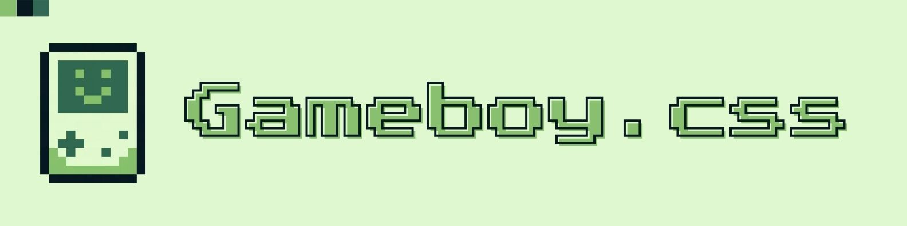

# Gameboy.css

<p align="center">
  
  <br>
  The pixel-perfect CSS framework for retro-inspired projects. Bring the nostalgic look and feel of the classic Game Boy to your web applications.
</p>

[](https://www.npmjs.com/package/gameboy-css-framework)
[](https://www.jsdelivr.com/package/gh/keinan21/gameboy-css-framework)
[](https://github.com/keinan21/gameboy-css-framework/blob/main/LICENSE)


---

## Table of Contents

- [Introduction](#introduction)
- [Features](#features)
- [Quick Start](#quick-start)
- [Usage](#usage)
- [Fonts](#fonts)
- [Examples](#examples)
- [Contributors](#contributors)

---

## Introduction

**Gameboy.css** is a lightweight CSS framework inspired by the iconic design of the original Nintendo Game Boy. It provides a set of pre-designed components and utility classes that allow you to easily create retro-themed websites and user interfaces with a distinctive pixel art aesthetic.

---

## Features

- 🎮 **Pixel-Perfect Design** — Replicates the look of the Game Boy.
- 🧩 **Modular** — Use only what you need.
- 📱 **Responsive (Basic)** — Works on various screen sizes.
- 🛠️ **Customizable** — Override styles easily.
- 🧠 **Intuitive Class Names** — Easy to remember and use.
- 📦 **Components Included** — Headers, Containers, Typography, Buttons, Forms, and more.

---

## Quick Start

### Via CDN

Add this to your `<head>` section:

```html
https://cdn.jsdelivr.net/gh/keinan21/gameboy-css-framework@v1.0.0/gameboy.css
```
```html
https://cdn.jsdelivr.net/gh/keinan21/gameboy-css-framework@v1.0.0/gameboy.js
```

### Via Package Manager

Install via npm:

```bash
npm i gameboy-css-framework
```

Then include it in your HTML or main stylesheet:

```html
<link rel="stylesheet" href="./node_modules/gameboy-css-framework/gameboy.css">
```

Or via CSS import:

```css
@import 'gameboy-css-framework/gameboy.css';
```

---

## Usage

Gameboy.css provides components and utility classes. You define your own layout and apply the styles.

### Containers

```html
<div class="gb-card primary">
  <h3>Item Acquired!</h3>
  <p>You found a Super Potion.</p>
</div>
```

### Buttons

```html
<button type="button" class="button primary">START</button>
```

### Check [this website](https://keinan21.github.io/gameboy-css-framework/) to see all component

---

## 🔤 Fonts

Gameboy.css uses the **Silkscreen** font by default, which is a pixel-style typeface perfect for retro interfaces.

✅ **No setup required** — The font is automatically imported via Google Fonts in the main CSS file.

---

## Examples

- **Showcase**: See `index.html` for a full demo.
- **Article Example**: See `comparisson.html`.
plain HTML vs Gameboy.css.

---

## Contributors

Thanks to the following people for contributing:

- **Keinan21** — Creator

---

## License

This project is licensed under the **MIT License**. See the LICENSE file for details.

---

## Support

Found a bug or have a suggestion? [Open an issue](https://github.com/keinan21/gameboy-css-framework)

Follow the project and stay updated with new features and releases!
